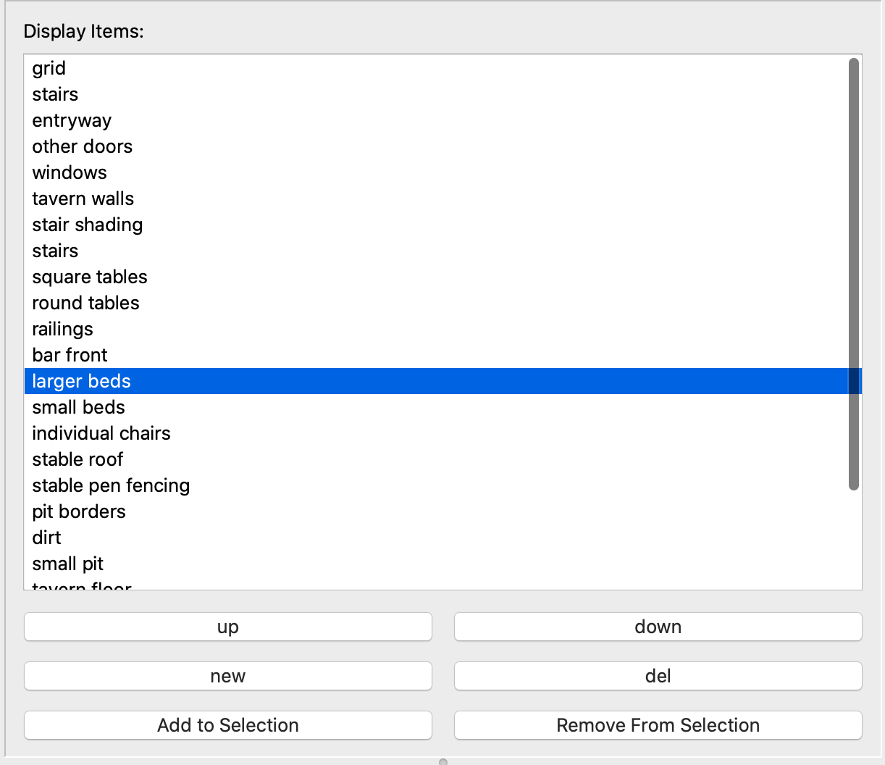

# **Using Encounter Mapper**

## Node Editor

The Node Editor is the primary view of Encounter Mapper Freeform. It contains data on the underlying geometry of your encounter map. This geometry can be added, modified, and removed through the following commands.
### Selection
+ **Left Click**: Select an item (Node, Line Shape). Selection depends on the select mode
+ **Shift + Left Click**: Add an item (Node, Line Shape) to the existing selection. Selection depends on the select mode
+ **Right Click**: Deselect an item (Node, Line Shape). Selection depends on the select mode
+ **Shift + Right Click**: Remove an item (Node, Line Shape) from the existing selection. Selection depends on the select mode
+ **A**: Toggle Select/Deselect all nodes in a layer

### Element Transforms and Manipulation
+ **G**: Begin Grab transformation for all selected elements
+ **R**: Begin Rotate transformation for all selected elements
+ **S**: Begin Scale transformation for all selected elements
+ **E**: Perform an extrusion from all selected Items. If selection type is NODE and no selected items, create a new Node.
+ **D**: Duplicate the selected Items
+ **F**: Form a line/shape from all selected nodes
+ **X**: Delete all selected items
+ **Shift + X**: Delete all nodes of the selected items.
+ **Transformation + Left Click**: Apply the current transform
+ **Transformation + Right Click**: Cancel the current transform

### Mode Toggles
+ **1**: Change selection type to Node
+ **2**: Change selection type to Line
+ **3**: Change selection type to Shape
+ **T**: Toggle the display of the Lines, Shapes, and Nodes
+ **L**: Toggle if some or all NodeLayer Images are displayed

### Encounter Map Controls
+ **Control + S**: Save encounter map
+ **Control + O**: Open encounter map
+ **Control + E**: Open export map dialog
+ **Control + R**: Open resize map dialog

## Display Item Sidebar Controls

### Layer Editor

+ **New Layer**: Add a new layer to the map
+ **Delete Layer**: Remove the current layer from the map
+ **<**: change current layer to the previous layer
+ **>**: change current layer to the next layer
+ **Move DOWN**: shift current layer position with previous layer
+ **Move UP**: shift current layer position with next layer

---
## Display Items
In order to create an encounter map, you need to add Display Items to the geometry created in the Node Editor. The following UI elements are used to create and interact with the Display Items

### Display Item List

The Display Item List contains all Display items in an encounter map. it allows for the creation, removal, and reordering of the display items. When Layers on the node editor are being drawn, the final order will be from top to bottom.
+ **up**: shift the selected display item up
+ **down**: shift the selected display item down
+ **new**: open the Display Item Creator dialog to create a new display item
+ **del**: remove the selected display item from the map
+ **Add to Selection**: if possible, add the selected display item to the selected items in the Node Editor
+ **Remove from Selection**: if possible, remove the selected display item from the selected items in the Node Editor

### Selected Display Items

The Selected display items list displays the attribute values of a given display item. There are 2 types of values: Shared and Individual. Shared values affect every instance of the display item, while individual only affect the display items currently selected by the node editor. Each attribute has a different way to set its value.

## Video Tutorial: [Part 1](https://youtu.be/bFfKhF5WtjE) [Part 2](https://youtu.be/5mvI_D_cwbA)
