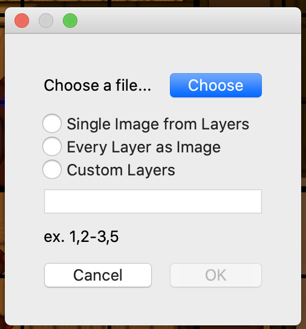

**Still in Development**

Encounter Mapper Freeform is a revamp of Encounter Mapper. Unlike its previous iteration, Freeform is no longer tied to developing tiles. Rather, the layout for the encounter is "drawn" through nodes, lines, and shapes, and properties are added on top of these underlying elements to display the map.

## [Manual](https://github.com/Symmanke/EncounterMapperFreeform/blob/master/EMFManual.md)
## Video Tutorial (TODO)

## **Current Features:**

- "Map Out" your layout by creating nodes, lines, and faces in a UI similar to programs such as Blender

- Add and Remove Properties to your elements through the sideBar
- Customize each instance of a property through individual values
- Create Multiple layers to create dungeons multiple stories high, or better organize your structures

- Customize exporting your image: export all layers together, individual, or something in-between.
